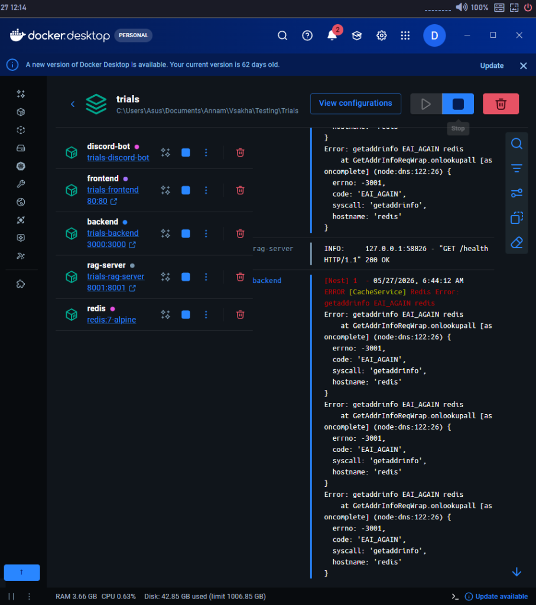
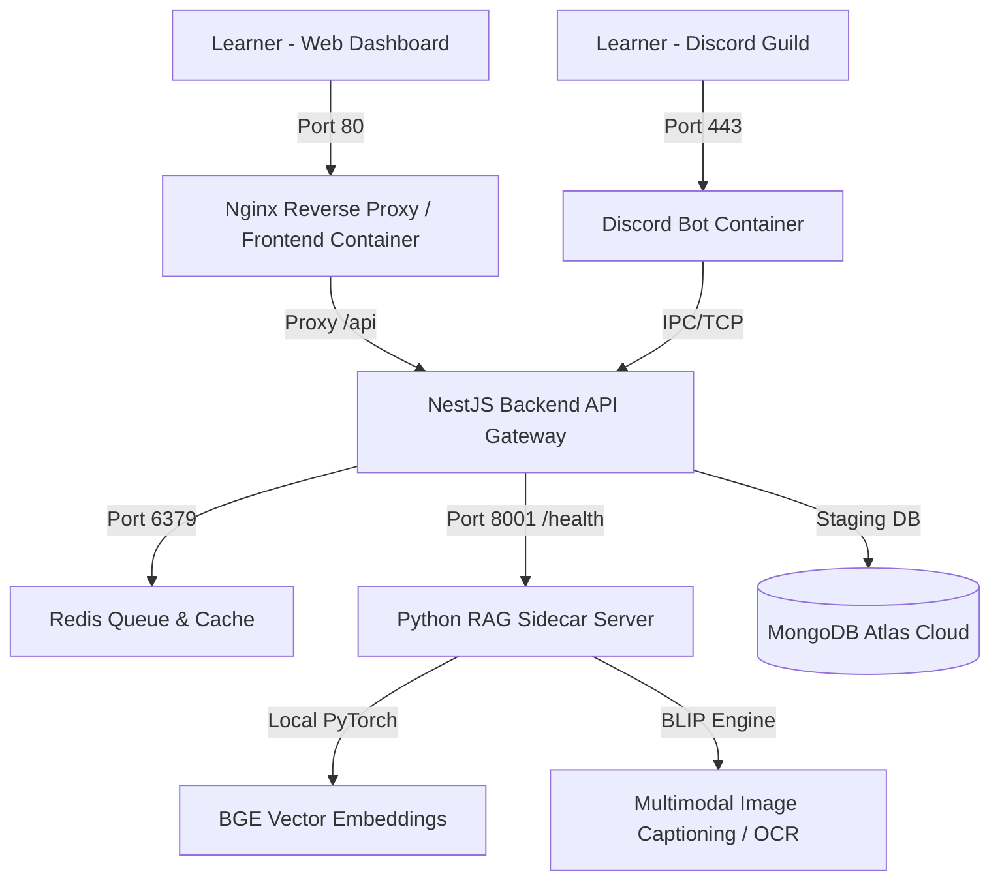

# 🌊 Vi-Sakha: AI-Driven Learner Support Ecosystem (v2.0.0)

[](https://opensource.org/licenses/MIT)
[](https://nestjs.com/)
[](https://www.anthropic.com/claude)
[](https://www.docker.com/)

---

# 📺 VI-SAKHA LANDING PAGE SCREENSHOT



---

## 📖 What is Vi-Sakha?

**Vi-Sakha** is a production-grade, state-of-the-art support ecosystem designed specifically for modern academic platforms (such as **VInternship**). It consolidates student inquiries, threads, and files from multiple disjointed channels—including **Discord**, **Web Dashboards**, and **External Interfaces**—into a unified support engine. 

Powered by a local, CPU-optimized **Retrieval-Augmented Generation (RAG) AI sidecar** combined with a robust **NestJS backplane** and a **React 18 frontend dashboard**, Vi-Sakha automates common academic answers while seamlessly escalating complex queries to human instructors via an advanced ticketing and video-meeting setup.

---

## 🎯 Why Was It Made? (The Problem & Purpose)

Modern educational bootcamps, universities, and virtual internships struggle with three critical scaling problems:
1. **Fragmented Communication Channels:** Students ask questions on Discord, raise issues via email, or use web interfaces. Instructors face "dashboard fatigue," switching between tools and frequently losing track of unresolved threads.
2. **Repetitive FAQs:** Up to 70% of student queries during virtual internships relate to repetitive configurations, links, rules, and installation guides. Instructors waste valuable hours copy-pasting the same answers.
3. **Delayed Support Feedback Loops:** When a student gets stuck on a programming bug, waiting 12+ hours for an instructor's response halts learning. 

**Vi-Sakha was built to:**
* Provide **instant, high-quality technical answers** 24/7 using semantic vectors.
* Unify all thread records from Discord, internal chats, and external APIs into a single **Normalized Conversation Plugin System** for instructors.
* Incorporate **Human-in-the-Loop (HITL) escalation** seamlessly; if the AI's answer confidence falls below a strict threshold, the student is instantly routed to a live support ticket where instructors can chat with them, assign/transfer issues, or launch **Google Meet** video sessions in one click.

---

## 🌟 Core Features Offered by Vi-Sakha

### 1. Interactive RAG Chatbot (Student Workspace)
* **Real-time SSE Token Streaming:** Leverages Server-Sent Events (SSE) and NDJSON to stream the AI chatbot's answers token-by-token.
* **Confidence Guardrails:** Scores retrieved Q&A pairs using local cosine similarity. If the relevance score drops below **`0.45`**, it prompts the student to transition to a web ticket.
* **Traceable Reasoning:** Displays exact references, confidence ratings, and data-flow node tracks (e.g. `Planner`, `Retriever`, `Synthesizer`) inside the chat panel.

### 2. Multi-Channel Data Harmonizer (Plugin System)
* **Plugin Architecture:** Utilizes a decoupled plugin module that dynamically registers and compiles data from three completely different sources:
  1. **`RagPlugin`:** Fetches standard internal chatbot histories.
  2. **`DiscordPlugin`:** Scrapes, cleans, and ingests raw transcripts from active Discord channels.
  3. **`LibreChatPlugin`:** Syncs conversations from external instances.
* **Auto-Proposal Candidates:** When a thread is marked resolved on Discord, an independent listener automatically generates high-quality Q&A templates, posting them as **QA Proposals** for instructors to approve or edit before adding to the system's verified knowledge base.

### 3. Synchronous & Asynchronous Support Ticket Suite
* **Live WebSockets Messaging:** Houses a bi-directional messaging gateway mapping to `/tickets` rooms via **Socket.io**.
* **Multimodal Vision OCR & Captioning:** Supports code snippet screenshot uploads. The backend uses the Python vision sidecar to perform OCR (extracting code blocks) and BLIP captioning (describing visual images) to append screenshots directly into the context stream.
* **Instant Video Meeting Spawner:** Allows instructors to spawn a live, authenticated Google Meet session and post it inside the ticket chat instantly.

### 4. Advanced Management Governance (Instructor Workspace)
* **Real-Time KPI Dashboards:** Tracks resolution rates, average resolution speed, student feedback counts (likes/dislikes), and topic hotspot trends.
* **Queue Ingestion:** Dynamic ticket controls (assigning instructors, transferring between cohorts, and resolving tickets).

---

## 🛠️ Complete Technical Stack

| Category | Technology Used | Description / Purpose |
| :--- | :--- | :--- |
| **Backend Core** | **NestJS 10 (TypeScript)** | Enterprise-grade, modular Node.js API backplane. |
| **Real-time WS** | **Socket.io** | Low-latency WebSockets gateway mapping to ticket rooms. |
| **Queue & Tasks** | **BullMQ & Redis** | Background queue processing and session caching. |
| **Primary Database**| **MongoDB Atlas + Mongoose** | Dynamic collection storage (conversations, tickets, Q&As). |
| **Frontend Core** | **React 18 + Vite** | SPA Framework compiling into static assets. |
| **Styling (CSS)** | **Tailwind CSS** | Premium responsive UI grids, styling, and dark mode. |
| **Animations** | **GSAP & Lenis** | Premium smooth scroll landing block micro-animations. |
| **State Management**| **Zustand** | Light, scalable client-side global state store. |
| **FastAPI Core** | **Python 3.10+ / FastAPI** | High-performance CPU sidecar for deep learning models. |
| **AI Models (HF)** | **BAAI/bge-small-en-v1.5** | High-density 384-dimensional text embeddings. |
| **Rerank Cross** | **BAAI/bge-reranker-base** | Scoring cross-encoder validating retrieval relevance. |
| **multimodal Vision** | **Salesforce BLIP + EasyOCR** | Deep-learning visual captioning and character extraction. |
| **Vector DB** | **ChromaDB** | Local persistent vector storage. |
| **Reverse Proxy** | **Nginx Alpine** | Proxies web assets and handles SPA fallback routings. |

---

## 🏗️ Modular Project Architecture

The monorepo is organized as a clean, decoupled, workspace structure:
*   `/backend` - NestJS API and WebSockets server.
*   `/frontend` - React web gateway client served via Nginx.
*   `/discord-bot` - Standalone NestJS listener container ingesting thread transcripts.
*   `/rag-server` - CPU-optimized FastAPI AI sidecar.
*   `/packages` - Centralized shared libraries (`@visakha/config`, `@visakha/prompts`, `@visakha/shared-types`, `@visakha/shared-utils`).
*   `/services` - Decoupled advanced microservices (scaffolds for LangGraph `agent-orchestrator`, `memory-service`, `retrieval-service`, etc.).



---

## 🐳 Running with Docker Compose (Recommended)

The entire ecosystem is orchestrated into five microservice containers. Follow these steps to build and launch in production mode:

### 1. Configure the Environment Files

Create the following files in the project root based on your credentials:

*   `.env.backend` (for the Backend microservice):
    ```env
    PORT=3000
    MONGODB_URI=mongodb+srv://your_mongo_uri_here
    REDIS_HOST=redis
    REDIS_PORT=6379
    EMBEDDING_SIDECAR_URL=http://rag-server:8001
    
    # AI Keys
    ANTHROPIC_API_KEY=sk-ant-api03-...
    GEMINI_API_KEY=AIzaSy...
    
    # Mailer Config (GMAIL App Password)
    GMAIL_USER=your-system-email@gmail.com
    GMAIL_PASS=your-google-app-password
    
    # Auth Providers
    FIREBASE_PROJECT_ID=vi-sakha
    FIREBASE_CLIENT_EMAIL=...
    FIREBASE_PRIVATE_KEY=...
    ```

*   `.env.bot` (for the Standalone Discord Bot microservice):
    ```env
    REDIS_HOST=redis
    REDIS_PORT=6379
    BACKEND_API_URL=http://backend:3000/api
    DISCORD_BOT_TOKEN=your_discord_bot_token_here
    DISCORD_GUILD_ID=your_guild_id
    DISCORD_CHANNEL_ID=your_channel_id
    INTERNAL_BOT_API_KEY=vsakha_internal_bot_secret
    ```

### 2. Run the Orchestrator

Execute Docker Compose from the root workspace directory:

```bash
# Build all 5 service containers and launch them in the background
docker compose up --build -d
```

### 3. Verify System Health

Verify that all service health checks pass fully:

```bash
# Check running container statuses
docker compose ps

# Monitor log streaming for the Python RAG Sidecar and Backend
docker compose logs -f backend rag-server
```

---

## 🛠️ Local Development Setup

To run services natively without Docker containers during active local engineering:

### Monorepo Workspaces Installation

Install root node dependencies to link all shared packages:
```bash
npm install
npm run build:packages
```

### Starting Individual Services

#### 1. Backend Service
```bash
cd backend
npm run start:dev
```
*   **Port:** `3000`
*   **Swagger Docs:** `http://localhost:3000/api/docs`

#### 2. Frontend Service
```bash
cd frontend
npm run dev
```
*   **Port:** `5173` (Hot Module Reload dev server)

#### 3. RAG AI Sidecar (FastAPI)
```bash
cd rag-server
# Configure your virtual environment
python -m venv .venv
source .venv/bin/activate # or .venv\Scripts\activate on Windows
pip install torch --index-url https://download.pytorch.org/whl/cpu
pip install -r requirements.txt

# Start the sidecar
python src/main.py
```
*   **Port:** `8001`
*   **Health Check URL:** `http://localhost:8001/health`

#### 4. Discord Bot Service
```bash
cd discord-bot
npm run start:dev
```

---

## 👥 Creators & Engineering Team

*   **Divyansh Gupta**
*   **Kshitij Pandey**
*   **Aditya BMV**
*   **Dilraj Singh**

---

<p align="center">
  Refactored to Production Grade with ❤️ for <b>Vinternship</b> Academic Support.
</p>
