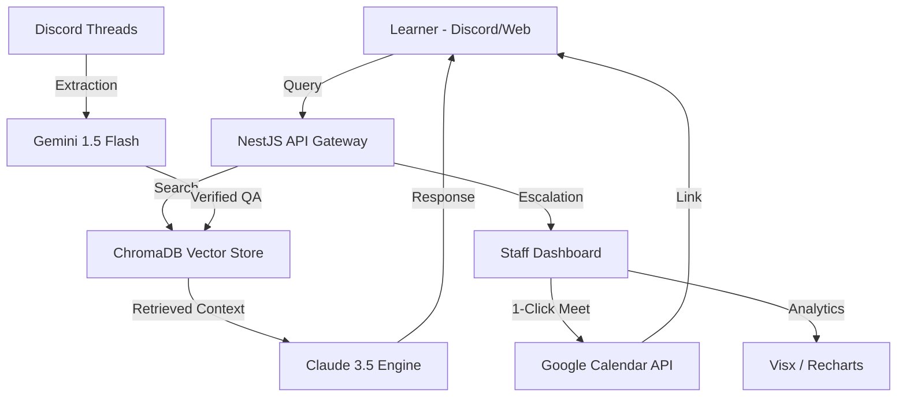

# 🌊 Vi-Sakha: AI-Driven Learner Support Ecosystem

[](https://opensource.org/licenses/MIT)
[](https://nestjs.com/)
[](https://www.anthropic.com/claude)

Vi-Sakha is a high-performance, multi-channel support ecosystem designed for modern educational platforms. It seamlessly integrates **Discord**, **Web Ticketing**, and **Synchronous Support** into a unified dashboard powered by a triple-layer GenAI stack (Claude, Gemini, and Local Embeddings).

---

## 🚀 Core Features

### 🤖 Intelligent Tier-1 Support (RAG)
*   **Semantic Search:** Real-time query resolution using high-density vector embeddings (BAAI/bge-small-en-v1.5).
*   **Policy Guardrails:** Responses are strictly grounded in official 2024+ website and policy documentation.
*   **Auto-Escalation:** Confidence-based routing. If AI confidence drops below **60%**, the query is automatically escalated to specialized staff.

### 📊 Advanced Command Center (Dashboard)
*   **Comprehensive KPIs:** Real-time visibility into total queries, AI resolution rates, and knowledge base growth.
*   **Feedback Analytics:** "Hotspot" tracking that identifies policy gaps or documentation weaknesses based on student sentiment.
*   **Live Discord Sync:** Automated synchronization of unresolved Discord threads directly into the support queue.

### 🎥 Synchronous Resolution Engine
*   **Instant Support Sessions:** One-click automated **Google Meet** generation with internal calendar synchronization.
*   **Staff Handover:** Seamless transition from AI-driven chat to live human intervention with full context retention.

---

## 🛠 Technology Stack

| Layer | Technologies |
| :--- | :--- |
| **Frontend** | React 18, Vite, Tailwind CSS, GSAP, Radix UI, Visx (Premium Charts), Framer Motion |
| **Backend** | NestJS (Node.js), Socket.io (Real-time), Passport (Auth), ioredis (Queueing) |
| **Database** | MongoDB Atlas (Structured Data), ChromaDB (Vector Knowledge Base) |
| **AI Stack** | **Claude 3.5 Sonnet** (Primary Reasoning), **Gemini 1.5 Flash** (Content Extraction), **HuggingFace** (Local Embeddings) |
| **DevOps** | Docker, Docker Compose, Firebase Admin, Google Cloud (OAuth 2.0) |

---

## 🏗 System Architecture



---

## ⚡ Quick Start

### Prerequisites
*   Node.js 20+
*   Python 3.10+
*   Docker & Docker Compose

### 🐳 Running with Docker (Recommended)
```bash
# Clone the repository
git clone https://github.com/your-org/vi-sakha.git
cd vi-sakha

# Setup Environment
cp .env.example .env

# Launch services
docker-compose up --build
```

### 🛠 Local Development Setup

#### 1. Backend
```bash
cd backend
npm install
npm run start:dev
```

#### 2. Frontend
```bash
cd frontend
npm install
npm run dev
```

#### 3. AI Pipeline (Python Sidecar)
```bash
cd pipeline
python -m venv .venv
source .venv/bin/activate # or .venv\Scripts\activate on Windows
pip install -r requirements.txt
```

---

## ⚙️ Environment Configuration

Ensure the following variables are configured in your `.env`:

```env
# AI Credentials
ANTHROPIC_API_KEY=sk-...
GEMINI_API_KEY=AI...
OPENAI_API_KEY=sk-...

# Databases
MONGODB_URI=mongodb+srv://...
REDIS_URL=redis://localhost:6379

# OAuth & Integration
GOOGLE_CLIENT_ID=...
GOOGLE_CLIENT_SECRET=...
GOOGLE_REFRESH_TOKEN=...
DISCORD_BOT_TOKEN=...
```

---

## 📈 System Capabilities

*   **92% AI Resolution:** Average autonomous resolution rate for tier-1 support.
*   **< 2 Hour SLA:** Tracking and notifications for human-escalated tickets.
*   **Zero-Copy Extraction:** Discord threads are converted to verified KB entries within seconds using Gemini Vision/Text extraction.

---

## 📜 License

Distributed under the MIT License. See `LICENSE` for more information.

---

## 👥 Creators

*   **Divyansh Gupta**
*   **Kshitij Pandey**
*   **Aditya BMV**
*   **Dilraj Singh**

---

<p align="center">
  Built with ❤️ for <b>Vinternship</b> Academic Support.
</p>
