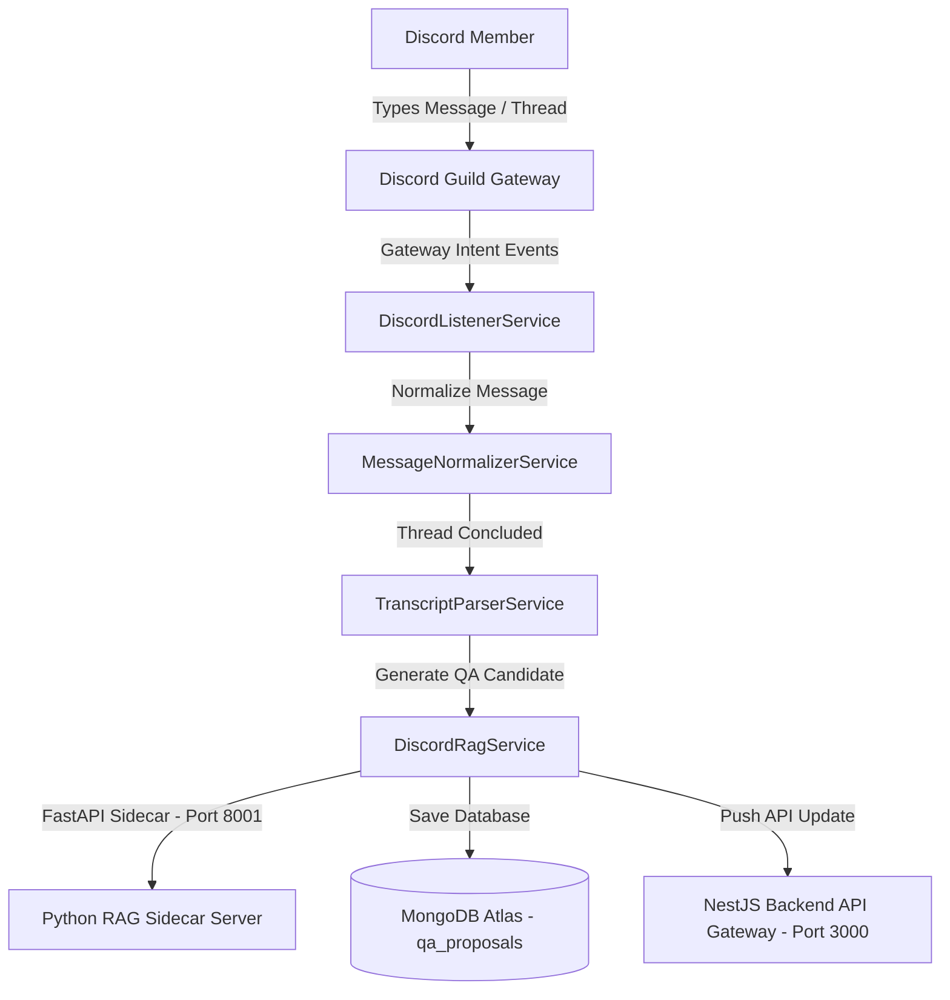

# 🤖 Vi-Sakha Standalone Discord Bot Service (v2.0.0)

This is the standalone **NestJS-based Discord Bot** container for the **Vi-Sakha** support ecosystem. Running as an independent background service, it actively listens to Discord Guild (Server) channels, automatically ingests conversation threads, converts them into standardized JSON transcript files, auto-tags topics using AI embeddings, and posts high-quality Q&A pairs to MongoDB as candidates for system-wide QA Proposals.

---

## 🏗️ Folder Structure & Architectural Layout

```text
discord-bot/
├── Dockerfile                  # Multi-stage production build configuration
├── package.json                # Project dependencies and script commands
├── tsconfig.json               # TypeScript Compiler flags and workspace imports
└── src/
    ├── main.ts                 # Service bootstraper initializing the Nest application context
    ├── bot.module.ts           # Root module connecting MongoDB, Http, and local services
    ├── schemas/                # Mongoose database models
    │   ├── discord-conversation.schema.ts  # Schema for keeping track of all Discord channel histories
    │   └── qa-proposal.schema.ts          # Schema for AI-generated Q&A proposals awaiting approval
    ├── events/
    │   └── discord.listener.ts            # Core listener registering Discord Bot gateway events
    ├── services/
    │   ├── discord.service.ts             # Gateway connection, channel manipulation, and message extraction
    │   ├── conversation.service.ts        # Operations for writing and querying Discord conversations
    │   ├── rag.service.ts                 # Interfaces with the RAG sidecar server for auto-tagging
    │   └── backend-api.service.ts         # Integrates back to the central NestJS API to push datasets
    └── utils/
        ├── message.normalizer.ts          # Standardizes raw Discord API message maps to system format
        └── transcript.parser.ts           # Parses uploaded files, transcripts, and threads
```

---

## 🔗 How Services Interact & Event Ingestion Flow



1. **Discord Event Gateway (`discord.listener.ts`):**
   * Establishes a socket connection to Discord utilizing the `discord.js` gateway intents (e.g. `Guilds`, `GuildMessages`, `MessageContent`).
   * Listens to real-time events like `messageCreate`, `threadCreate`, and `threadUpdate`.

2. **Parsing & Normalizing (`message.normalizer.ts` / `transcript.parser.ts`):**
   * When threads or support rooms are resolved inside Discord, the bot triggers transcript ingestion.
   * Cleans emojis, bot notifications, and standardizes messages into a `NormalizedMessage[]` payload, tracing participant roles (Student, Instructor, Bot).

3. **GenAI Q&A Ingestion (`rag.service.ts` / `backend-api.service.ts`):**
   * Calls the FastAPI RAG Sidecar server or processes raw transcripts with Claude/Gemini to extract high-value Q&A templates.
   * Saves the generated questions and answers inside MongoDB under the `qa_proposals` collection (monitored by the main Web Dashboard).
   * Notifies the main NestJS API of new pending proposals via HTTP REST calls, utilizing an internal token key (`INTERNAL_BOT_API_KEY`) for secure verification.

---

## ⚙️ Core Environment Settings

The bot expects the following variables to be set in `.env.bot` or system environments:
```env
# Database & Network
MONGODB_URI=mongodb+srv://your_mongo_uri_here
REDIS_HOST=redis
REDIS_PORT=6379
BACKEND_API_URL=http://backend:3000/api

# Discord Guild Token Credentials
DISCORD_BOT_TOKEN=MTIyND... # Your secret Discord Bot Application Token
DISCORD_GUILD_ID=12247...  # The ID of your target Discord Guild Server
DISCORD_CHANNEL_ID=12247...# The default channel ID for support threads

# Internal Security
INTERNAL_BOT_API_KEY=vsakha_internal_bot_secret
```

---

## 🚀 Native Local Development Setup

To run the Discord Bot natively in development mode:

### 1. Install Dependencies
```bash
cd discord-bot
npm install
```

### 2. Add Environment Variables
Make sure you have created `.env.bot` at the root of the project workspace or inside the `/discord-bot` directory.

### 3. Spin Up Development Daemon
Compiles and starts the bot with a hot-reload daemon watcher:
```bash
npm run start:dev
```

### 4. Build for Production
Compiles the TypeScript source directly to highly-optimized JavaScript files inside `/dist`:
```bash
npm run build
npm start
```
