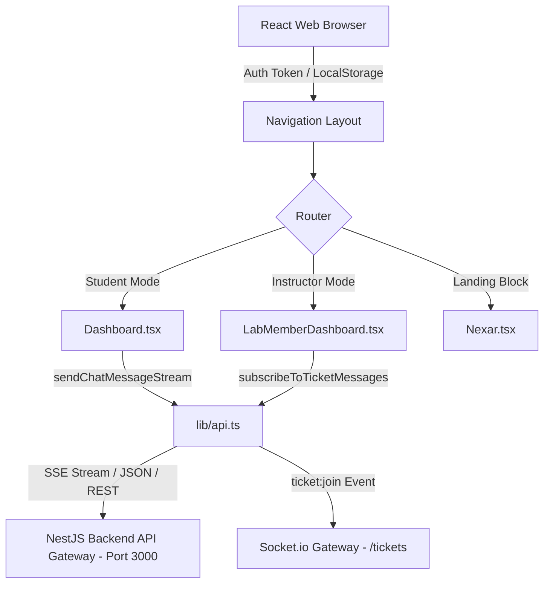

# 🖥️ Vi-Sakha Frontend Client Gateway (v2.0.0)

Welcome to the **Vi-Sakha Frontend**! This dashboard is built with **React 18** and **Vite**, utilizing a premium user interface with TailwindCSS. It provides a seamless interface for both **students** (for interacting with the AI-powered RAG chatbot and raising support tickets) and **instructors/lab members** (for managing tickets, resolving student queries, and starting synchronous video-call sessions).

---

## 🏗️ Folder Structure & Architectural Layout

The frontend source is highly modularized inside the `/src` directory to support clean separation of concerns and scalable development:

```text
frontend/
├── Dockerfile                  # Containerizes the frontend client (multi-stage build)
├── nginx.conf                  # Nginx proxy server configurations and route fallback handler
├── package.json                # Project dependencies and operational scripts
├── tailwind.config.js          # Tailwind CSS layout, colors, and styling declarations
├── index.html                  # Core HTML entry point containing the Socket.io CDN script
└── src/
    ├── App.tsx                 # Core React app router and workspace context provider
    ├── main.tsx                # Entry point rendering the React root element to DOM
    ├── components/             # Reusable UI component modules (buttons, inputs, cards)
    │   ├── sections/           # Large sections like Landing Page blocks, helpdesk views
    │   └── ui/                 # Small atomic elements (buttons, modals, dialogs)
    ├── pages/                  # Full-page routing components
    │   ├── Dashboard.tsx       # Unified Student Workspace (chatbot, ticketing list, etc.)
    │   ├── LabMemberDashboard.tsx  # Unified Instructor Workspace (assign, transfer, resolve tickets, meetings)
    │   ├── Login.tsx           # Authentication gateway with credential-based forms
    │   ├── Register.tsx        # Registration onboarding form
    │   ├── Settings.tsx        # Personal account adjustments and dynamic settings
    │   ├── Nexar.tsx           # Landing Page incorporating GSAP scroll animations
    │   └── ApiDocs.tsx         # In-dashboard interactive developer documentation
    ├── lib/
    │   └── api.ts              # Universal client library executing all HTTP REST fetch & WebSocket connections
    ├── layouts/
    │   └── Navigation.tsx      # Sidebar and header responsive layouts
    ├── features/               # Large domain specific logic modules (e.g. Chat client, Ticket rooms)
    ├── hooks/                  # Custom React hooks (e.g. useAuth, useTickets, useSocket)
    ├── store/                  # Global client state management (Zustand)
    ├── styles/                 # Global styles and tailwind directives
    └── types/                  # Local and mirrored shared TypeScript interfaces
```

---

## 🔗 How Components Connect & Data Flow



1. **User Authentication (`Login.tsx` / `Register.tsx`):**
   * Authenticates with credentials against the NestJS Mock Auth system.
   * Saves the JWT to `localStorage` under key `vs_token`.
   * Automatically attaches this token to every outgoing HTTP request header as `Authorization: Bearer <token>` via the helper wrapper `authFetch`.

2. **Student Conversation Engine (`Dashboard.tsx`):**
   * Students type in the chatbot panel to interact with **Vi-Sakha**.
   * Calls the `sendChatMessageStream` function inside `lib/api.ts` using a custom SSE client parser (`ndjson`), showing real-time token streaming.
   * Enables manual ticket creation with image attachment (base64-encoded screenshot strings) if the RAG answer confidence falls below `0.45` threshold.

3. **Instructor Ticket Workspace & Live Chat (`LabMemberDashboard.tsx`):**
   * Displays all active tickets across all modules.
   * Allows real-time WebSockets communication with students via the standard **Socket.io** library client (loaded dynamically via CDN from `api.ts`).
   * Connects to `/tickets` gateway namespace, automatically joining/leaving channels via custom hooks when rooms change.
   * Allows generating synchronous meeting rooms (Google Meet API proxies) in one click to jump on calls with students.

---

## ⚙️ Nginx Reverse Proxy Config (`nginx.conf`)

In production environments (Docker orchestrated), the built frontend is served via an **Nginx Alpine** web server mapping to port `80:80`.
* **SPA Routing Fallback:** Since React utilizes client-side routing (`react-router-dom`), Nginx is configured to redirect all unhandled requests to `index.html` via `try_files $uri $uri/ /index.html`.
* **API Gateway Proxying:** Proxies all paths matching `/api/*` directly to the `backend:3000` NestJS docker container, solving Cross-Origin Resource Sharing (CORS) challenges.

---

## 🚀 Native Local Development Setup

To run the frontend service locally outside of Docker containers:

### 1. Install Dependencies
Ensure you are inside the frontend folder, then execute:
```bash
npm install
```

### 2. Configure Local Environment
Create a `.env` or `.env.local` file inside `/frontend` matching:
```env
VITE_API_URL=http://localhost:3000
```

### 3. Run Development Server
Spins up a local server on port `5173` with Hot Module Replacement (HMR):
```bash
npm run dev
```
Open [http://localhost:5173](http://localhost:5173) in your browser.

### 4. Code Linting & Static Validation
Scan TypeScript components for formatting or logic errors:
```bash
npm run lint
```

### 5. Compiling a Production Build
Compile TypeScript files and bundle static html/js/css using Vite:
```bash
npm run build
```
The compiled output is located under `/dist` and is ready to be served by any static hosting provider or Nginx!
