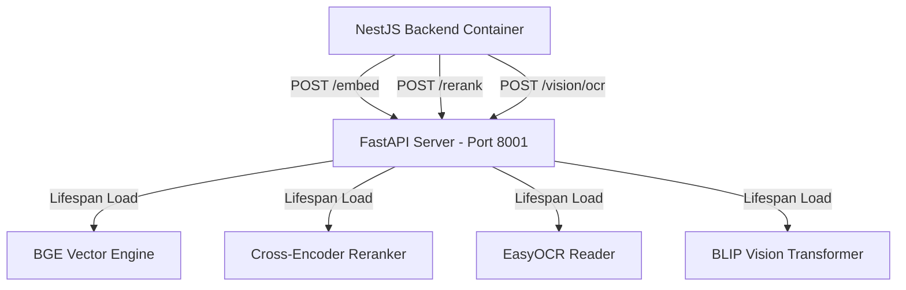

# 🧠 Vi-Sakha AI Python RAG Sidecar Server (v3.0.0)

This is the standalone **Python FastAPI RAG (Retrieval-Augmented Generation) Sidecar Server** for **Vi-Sakha**. Optimized for high-throughput, low-latency CPU processing, it hosts local deep learning models (BGE Embeddings, BGE Rerankers, and Salesforce BLIP Multimodal engines) to serve embeddings, perform document reranking, execute Optical Character Recognition (OCR), and generate multimodal image captions.

---

## 🏗️ Folder Structure & Architectural Layout

```text
rag-server/
├── Dockerfile                  # Slim Debian build setting up PyTorch CPU and preloading HuggingFace caches
├── requirements.txt            # Python dependencies (FastAPI, PyTorch, Transformers, EasyOCR)
└── src/
    ├── __init__.py
    ├── main.ts                 # FastAPI API router exposing services and handling eager preloading
    ├── config/                 # Configurations loaded from system environment variables
    ├── embeddings/
    │   └── service.py          # Interface for BAAI/bge-small-en-v1.5 CPU vector embeddings
    ├── retrieval/
    │   └── reranker.py         # Interface for BAAI/bge-reranker-base cross-encoder reranking
    ├── services/
    │   ├── ocr.py              # Optical Character Recognition engine powered by EasyOCR
    │   └── captioning.py       # Image caption generator powered by Salesforce BLIP model
    └── vectorstore/
        └── store.py            # Local interface managing ChromaDB indexes and retrieval bounds
```

---

## ⚡ Eager Model Preloading & Lifespan Architecture

Loading HuggingFace models on-the-fly during API request operations introduces major latency spikes (up to 30 seconds per query). The RAG Sidecar resolves this by implementing a **Lifespan Context Manager** (`asynccontextmanager` in `main.py`).

On service startup, the server automatically preloads the following models into CPU RAM:
1. **Embedding Model (`BAAI/bge-small-en-v1.5`):** Generates 384-dimensional vector embeddings for semantic similarity.
2. **Reranking Model (`BAAI/bge-reranker-base`):** Cross-encoder model that scores query-document pairs to fine-tune retrieval relevance.
3. **OCR Reader (`EasyOCR`):** Extracts printed text from screenshots/images.
4. **Captioning Model (`Salesforce/blip-image-captioning-base`):** Translates visual screenshots into descriptive English captions for conversational injection.

Once preloading completes successfully, the sidecar marks itself as healthy, allowing the Docker stack orchestrator or dependent NestJS backend to initialize.

---

## 🔗 How Services Interact & API Integration Flow



1. **Semantic Search Flow:**
   * User query hits NestJS. NestJS calls `/embed` on FastAPI with user query.
   * NestJS takes the generated query vector, runs cosine similarity against MongoDB, gets top 20 candidate Q&A matches.
   * NestJS calls `/rerank` on FastAPI, sending the user query and the 20 text contents.
   * FastAPI scores them, filters by relevance threshold (`0.45`), and returns the top 5 sorted candidates back to NestJS.

2. **Multimodal Screenshot Support:**
   * Student uploads a code screenshot in a ticket or chat.
   * NestJS receives it, converts it to base64, and POSTs it to `/vision/ocr` and `/vision/caption` on the FastAPI server.
   * FastAPI runs OCR to extract exact code tokens and BLIP to generate a descriptive text context of the visual screenshot.
   * Returns these back to NestJS, which appends them into the RAG context or ticket threads so the AI model understands the student's exact screen details!

---

## 🔗 Endpoints Specifications

| Method | Endpoint | Payload Format | Description |
| :--- | :--- | :--- | :--- |
| **GET** | `/health` | None | Returns JSON showing healthy status and active features. |
| **POST** | `/embed` | `{"text": "my query"}` | Generates a single 384-dimensional vector embedding array. |
| **POST** | `/embed/batch` | `{"texts": ["text1", "text2"]}` | Generates a list of vector embedding arrays in bulk. |
| **POST** | `/rerank` | `{"query": "...", "documents": ["...", "..."], "top_n": 5}`| Scores documents against the query to measure semantic relevancy. |
| **POST** | `/vision/ocr` | `{"image_base64": "..."}` | Runs OCR scan to extract textual tokens from screenshots. |
| **POST** | `/vision/caption`| `{"image_base64": "..."}` | Generates a concise textual description of a base64 image. |

---

## 🚀 Native Local Development Setup

To start the FastAPI server natively on a local host:

### 1. Configure Python Virtual Environment
Navigate to the directory and initialize a virtual environment:
```bash
cd rag-server
python -m venv .venv
```

Activate the environment:
* **Windows (PowerShell):** `.venv\Scripts\Activate.ps1`
* **Linux / macOS:** `source .venv/bin/activate`

### 2. Install PyTorch & Dependencies
To ensure performance optimization, install the **CPU-only version of PyTorch** first:
```bash
pip install torch --index-url https://download.pytorch.org/whl/cpu
```

Then install the remaining library dependencies:
```bash
pip install -r requirements.txt
```

### 3. Start the FastAPI Service
Launch the Uvicorn gateway:
```bash
python src/main.py
```
* **Port:** `8001`
* **Health Check API URL:** [http://localhost:8001/health](http://localhost:8001/health)
