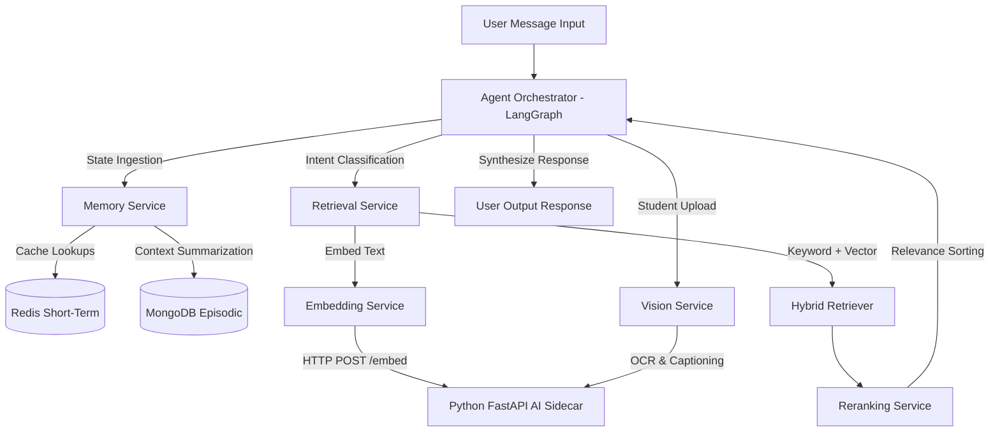

# ⚙️ Vi-Sakha AI Microservices Architecture

This directory houses the highly decoupled, advanced AI microservices that power **Vi-Sakha**. These services represent a production-ready **LangGraph orchestrator graph**, a **hybrid retrieval pipeline**, a **4-tier cached memory system**, and a **multimodal visual context generator**. 

---

## 🏗️ Folder Structure & Decoupled Services

```text
services/
├── agent-orchestrator/   # LangGraph-based conversational and tooling agent planner
├── embedding-service/    # Local circuit-breaking abstraction over the Python embedding sidecar
├── memory-service/       # 4-tier stateful memory manager (Redis, Mongo, Qdrant, LangGraph)
├── reranking-service/    # Pluggable reranking scoring pipeline (local cross-encoder / Cohere API)
├── retrieval-service/    # Hybrid keyword + vector database retriever executing in parallel
└── vision-service/       # Document parses, base64 OCR scans, and image BLIP captions
```

---

## 🔗 Services Collaboration & Data Flow



---

## 🛠️ Summary of Services & Phase Status

### 1. Agent Orchestrator (`/agent-orchestrator`)
* **Role:** The main conversational planner. Uses **LangGraph** to build a reliable StateGraph that runs intent classification, router dispatches, parallel tool calls, response synthesis, and reflection quality guards.
* **Status:** Scaffolded. Implementation is locked in **Phase 2**.

### 2. Embedding Service (`/embedding-service`)
* **Role:** Acts as a resilient node client for the Python AI sidecar. Wraps REST calls with circuit-breaking, retries, and batch requests to guarantee high availability.
* **Status:** Scaffolded. Implementation is locked in **Phase 4**.

### 3. Memory Service (`/memory-service`)
* **Role:** Manages the **4-tier memory** system for context-aware conversations:
  * **Short-Term (Redis):** Handles active conversation state with a 30-minute sliding window.
  * **Episodic (MongoDB):** Houses AI-summarized past conversations to reduce token footprints.
  * **Semantic (Qdrant):** Performs vector search against user memory banks.
  * **Working (LangGraph):** In-memory transient variables for reasoning loops.
* **Status:** Scaffolded. Implementation is locked in **Phase 3**.

### 4. Reranking Service (`/reranking-service`)
* **Role:** Re-evaluates retrieval candidates. Takes the top 20 retrieved documents from vector stores and scores them against the user query, keeping only the top 5 highly matching candidates.
* **Status:** Scaffolded. Implementation is locked in **Phase 4**.

### 5. Retrieval Service (`/retrieval-service`)
* **Role:** Orchestrates hybrid retrieval. Synthesizes lexical searches (full-text search) and semantic searches (vector database queries) in parallel to locate exact solutions.
* **Status:** Scaffolded. Implementation is locked in **Phase 4**.

### 6. Vision Service (`/vision-service`)
* **Role:** Multimodal data handler. OCR extraction for screenshots, BLIP engines for image captioning, CLIP vector embeds, and structured PDF document parsers.
* **Status:** Scaffolded. Implementation is locked in **Phase 5**.

---

## ⚙️ Workspaces Integration
All services utilize the common libraries from `/packages` (such as `@visakha/config` for system parameters and `@visakha/shared-types` for strict contracts). This setup keeps imports clean and ensures safe compilations.
